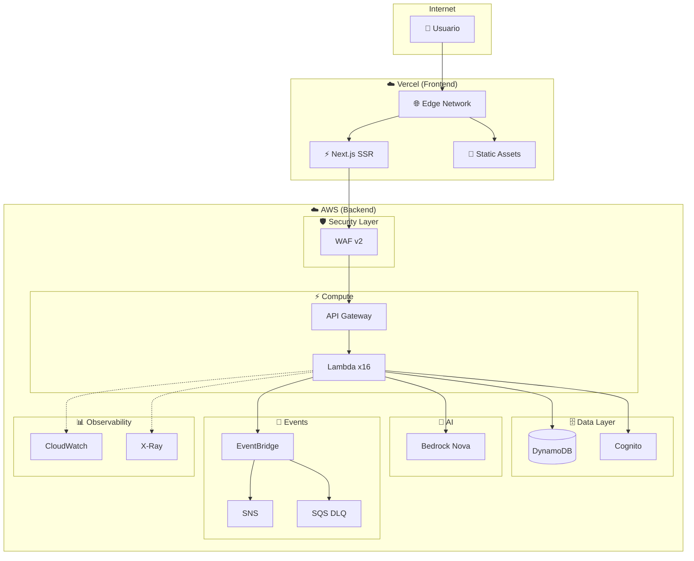
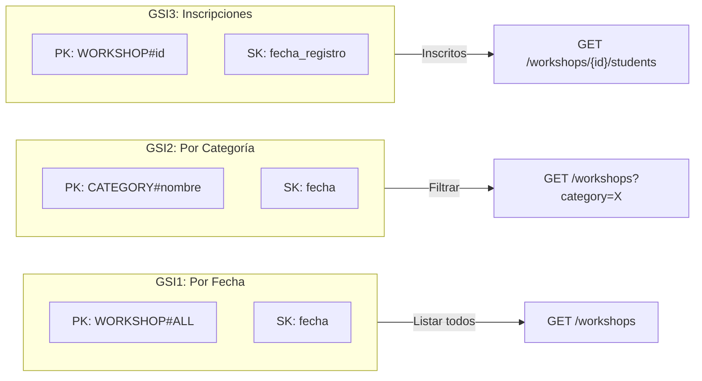
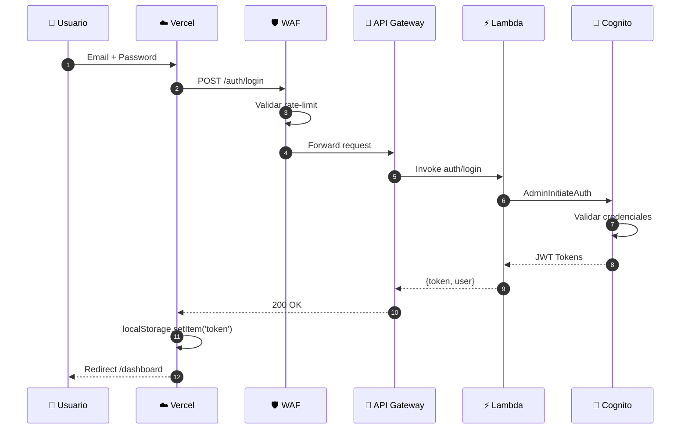
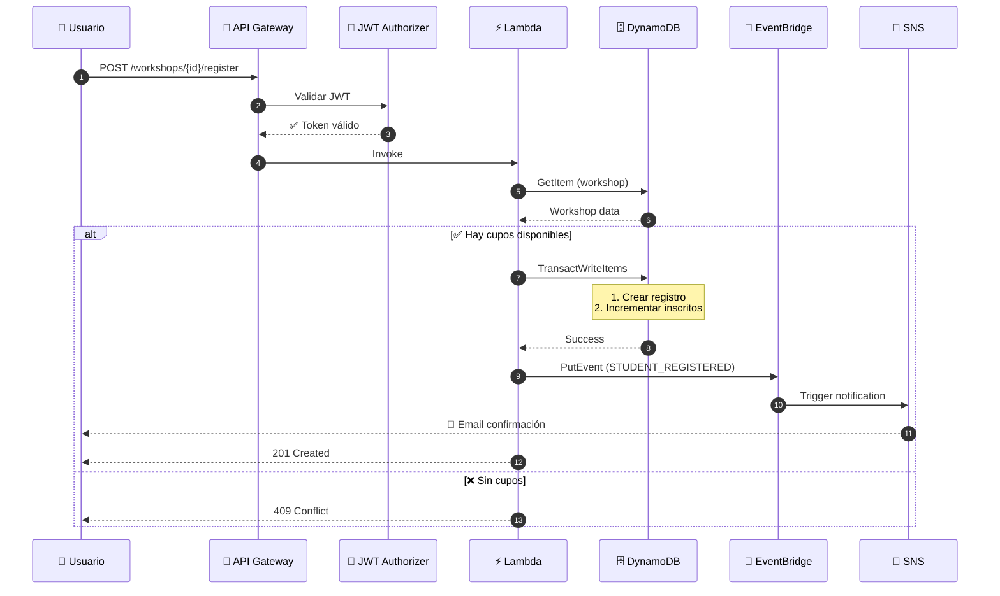
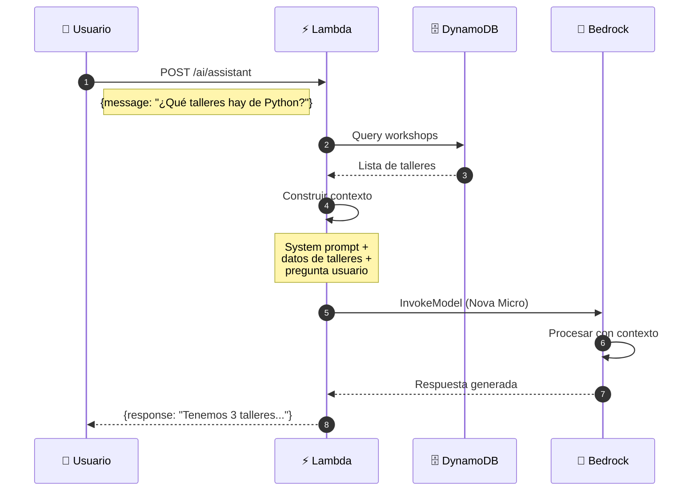
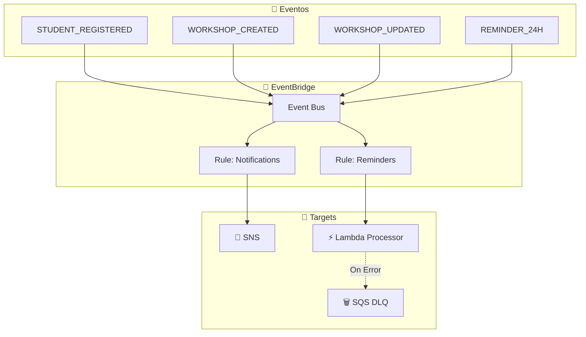
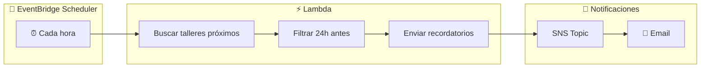
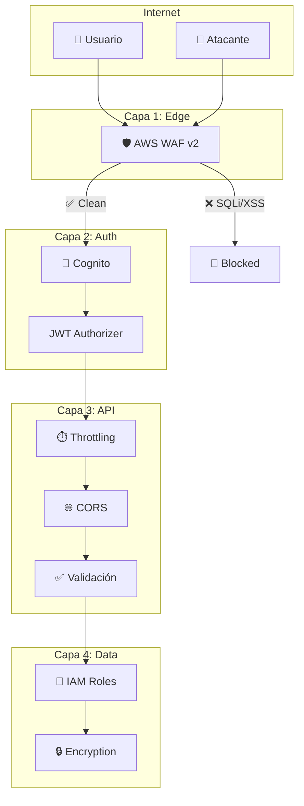
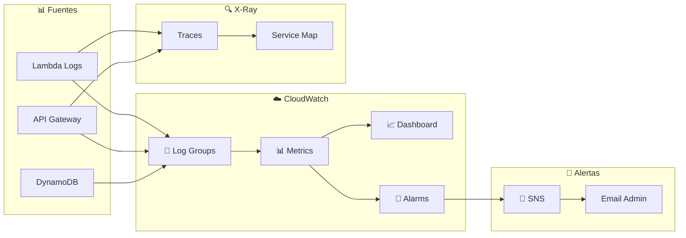

<!-- Banner animado -->
<p align="center">
  
</p>

<!-- Typing SVG -->
<p align="center">
  <a href="https://git.io/typing-svg">
    
  </a>
</p>

<!-- Badges principales -->
<p align="center">
  
  
  
  
  
</p>

<p align="center">
  <a href="#-demo">Demo</a> •
  <a href="#-por-qué-vercel">Por qué Vercel</a> •
  <a href="#-api">API</a> •
  <a href="#-flujos-internos">Flujos</a> •
  <a href="#-requisitos-cumplidos">Requisitos</a>
</p>

<br/>

## 🌐 Demo

<table>
<tr>
<td>

### 🖥️ Frontend (Vercel)
[](https://skills-forge-main.vercel.app)

`skills-forge-main.vercel.app`

</td>
<td>

### 🚪 API (AWS)
[](https://qt6hwpaad0.execute-api.us-east-1.amazonaws.com/dev/)

`qt6hwpaad0.execute-api.us-east-1.amazonaws.com/dev`

</td>
</tr>
</table>

> [!NOTE]
> El frontend usa Vercel mientras que el backend está 100% en AWS. Ver [Por qué Vercel](#-por-qué-vercel) para más detalles.

<br/>

## ⚡ Stack Tecnológico

<table>
<tr>
<td align="center" width="96">

<br><b>Next.js 15</b>
<br><sub>App Router</sub>
</td>
<td align="center" width="96">

<br><b>React 19</b>
<br><sub>Server Components</sub>
</td>
<td align="center" width="96">

<br><b>Tailwind</b>
<br><sub>+ shadcn/ui</sub>
</td>
<td align="center" width="96">

<br><b>TypeScript</b>
<br><sub>Strict mode</sub>
</td>
<td align="center" width="96">

<br><b>Vercel</b>
<br><sub>Edge Network</sub>
</td>
</tr>
<tr>
<td align="center" width="96">

<br><b>Python 3.11</b>
<br><sub>Lambda Runtime</sub>
</td>
<td align="center" width="96">

<br><b>AWS CDK</b>
<br><sub>IaC</sub>
</td>
<td align="center" width="96">

<br><b>DynamoDB</b>
<br><sub>Single-Table</sub>
</td>
<td align="center" width="96">

<br><b>Cognito</b>
<br><sub>Auth + JWT</sub>
</td>
<td align="center" width="96">

<br><b>Bedrock</b>
<br><sub>Nova Micro</sub>
</td>
</tr>
</table>

<br/>

## 🏗️ Arquitectura

<details open>
<summary><b>🔍 Ver diagrama de arquitectura completo</b></summary>
<br/>



</details>

<br/>

## 🚀 Por qué Vercel (y no S3)

> [!IMPORTANT]
> **S3 no puede ejecutar Next.js 15.** Punto. S3 solo guarda y sirve archivos estáticos (HTML, CSS, JS, imágenes). Pero Next.js 15 con App Router necesita ejecutar código en el servidor para funcionar.

### El problema

Nuestro frontend usa cosas que necesitan un servidor corriendo:

- **Server Components** - React se ejecuta en el servidor, no en el navegador
- **Server Actions** - Funciones que corren en el servidor desde un botón
- **Rutas dinámicas** - Páginas que se generan al momento de la petición
- **Middleware** - Código que corre antes de cada request

S3 es un bucket de archivos. No ejecuta código. Es como querer correr un programa de Python en una carpeta de Google Drive - simplemente no funciona.

### La solución

Vercel es de los mismos que crearon Next.js, así que lo soportan al 100%:

| Qué necesitamos | S3 | Vercel |
|-----------------|:--:|:------:|
| Server Components | ❌ | ✅ |
| Server Actions | ❌ | ✅ |
| Páginas dinámicas | ❌ | ✅ |
| Middleware | ❌ | ✅ |

<details>
<summary><b>¿Y si quiero quedarme en AWS?</b></summary>

Hay opciones, pero son más complicadas:

- **AWS Amplify** - Funciona pero tiene sus limitaciones con Next.js 15
- **Lambda@Edge + S3** - Posible pero un dolor de cabeza configurarlo
- **ECS/Fargate** - Muy overkill para esto, y ya no es serverless de verdad

Vercel hace todo esto automático con un `git push`.

</details>

<br/>

## 📊 Recursos AWS Desplegados

<details open>
<summary><b>Ver recursos en producción</b></summary>

| Servicio | Recurso | Detalles |
|:--------:|---------|----------|
|  | `qt6hwpaad0` | REST API + WAF |
|  | `SkillsForge-Dev-Workshops` | 37 items, 3 GSIs |
|  | `us-east-1_pcERcMaid` | 7 usuarios |
|  | 16 funciones | Python 3.11 |
|  | `SkillsForge-Dev-EventBus` | Event-driven |
|  | `SkillsForge-Dev-Notifications` | Email alerts |

</details>

<br/>

## 🗄️ Modelo de Datos

> [!TIP]
> Usamos **Single-Table Design** para minimizar costos y maximizar rendimiento.

<details>
<summary><b>📊 Ver diagrama ER de entidades</b></summary>
<br/>

```mermaid
erDiagram
    WORKSHOPS ||--o{ REGISTRATIONS : tiene
    USERS ||--o{ REGISTRATIONS : hace
    
    WORKSHOPS {
        string PK
        string SK
        string nombre
        string descripcion
        int cupo_maximo
        int inscritos
        date fecha
        string categoria
    }
    
    USERS {
        string PK
        string SK
        string nombre
        string role
        date created_at
    }
    
    REGISTRATIONS {
        string PK
        string SK
        string workshop_nombre
        date fecha_registro
    }
```

</details>

### 📐 Estructura de Claves

| Entidad | PK | SK |
|---------|----|----|  
| 🎓 Taller | `WORKSHOP#{uuid}` | `META` |
| 👤 Usuario | `USER#{email}` | `META` |
| 📝 Inscripción | `USER#{email}` | `REGISTRATION#{workshop_id}` |

<details>
<summary><b>🔍 Ver diagrama de GSIs</b></summary>
<br/>



</details>

| GSI | Partition Key | Sort Key | Uso |
|-----|---------------|----------|-----|
| GSI1 | `WORKSHOP#ALL` | `fecha` | Listar todos por fecha |
| GSI2 | `CATEGORY#{nombre}` | `fecha` | Filtrar por categoría |
| GSI3 | `WORKSHOP#{id}` | `fecha_registro` | Listar inscritos |

<details>
<summary><b>📝 Ejemplo de Items en DynamoDB</b></summary>

```json
// 🎓 Taller
{
  "PK": "WORKSHOP#abc-123",
  "SK": "META",
  "GSI1PK": "WORKSHOP#ALL",
  "GSI1SK": "2024-02-15",
  "GSI2PK": "CATEGORY#desarrollo",
  "nombre": "Docker para Developers",
  "descripcion": "Aprende contenedores desde cero",
  "cupo_maximo": 30,
  "inscritos": 12,
  "fecha": "2024-02-15T10:00:00Z"
}

// 👤 Usuario
{
  "PK": "USER#juan@email.com",
  "SK": "META",
  "nombre": "Juan Pérez",
  "role": "student",
  "created_at": "2024-01-10T08:30:00Z"
}

// 📝 Inscripción
{
  "PK": "USER#juan@email.com",
  "SK": "REGISTRATION#abc-123",
  "GSI3PK": "WORKSHOP#abc-123",
  "GSI3SK": "2024-01-20T14:00:00Z",
  "workshop_nombre": "Docker para Developers",
  "workshop_fecha": "2024-02-15T10:00:00Z"
}
```

</details>

<br/>

## 🔗 API REST

> Base URL: `https://qt6hwpaad0.execute-api.us-east-1.amazonaws.com/dev`

### Endpoints Públicos

| Método | Endpoint | Descripción |
|:------:|----------|-------------|
|  | `/workshops` | Listar talleres |
|  | `/workshops/{id}` | Detalle de taller |
|  | `/workshops/categories` | Categorías |
|  | `/stats` | Estadísticas |
|  | `/auth/login` | Iniciar sesión |
|  | `/auth/register` | Registrarse |

### Endpoints Protegidos (JWT)

| Método | Endpoint | Role | Descripción |
|:------:|----------|:----:|-------------|
|  | `/workshops/{id}/register` | 🎓 | Inscribirse |
|  | `/workshops/{id}/register` | 🎓 | Cancelar inscripción |
|  | `/registrations/mine` | 🎓 | Mis inscripciones |
|  | `/ai/assistant` | 🎓 | Chat con IA |
|  | `/workshops` | 👑 | Crear taller |
|  | `/workshops/{id}` | 👑 | Editar taller |
|  | `/workshops/{id}` | 👑 | Eliminar taller |

> 🎓 = Student &nbsp;&nbsp; 👑 = Admin

<details>
<summary><b>📝 Ejemplos de Request/Response</b></summary>

**Login:**
```bash
curl -X POST https://qt6hwpaad0.execute-api.us-east-1.amazonaws.com/dev/auth/login \
  -H "Content-Type: application/json" \
  -d '{"email": "usuario@mail.com", "password": "MiPassword123!"}'
```

**Response:**
```json
{
  "token": "eyJhbGciOiJSUzI1NiIs...",
  "user": {
    "email": "usuario@mail.com",
    "role": "student",
    "nombre": "Usuario Demo"
  }
}
```

---

**Inscribirse a taller:**
```bash
curl -X POST .../workshops/abc-123/register \
  -H "Authorization: Bearer {token}"
```

**Response:**
```json
{
  "message": "Inscripción exitosa",
  "workshop": "Docker para Developers",
  "fecha": "2024-02-15T10:00:00Z"
}
```

</details>

<br/>

## 🔄 Flujos Internos

<details>
<summary><b>🔐 Flujo de Autenticación</b></summary>
<br/>



</details>

<details>
<summary><b>📝 Flujo de Inscripción a Taller</b></summary>
<br/>



</details>

<details>
<summary><b>🤖 Flujo del Asistente IA (Bedrock)</b></summary>
<br/>



</details>

<details>
<summary><b>📊 Sistema de Eventos (EventBridge)</b></summary>
<br/>



</details>

<details>
<summary><b>⏰ Recordatorios Automáticos</b></summary>
<br/>



</details>

<br/>

## ✅ Requisitos Cumplidos

<table>
<tr>
<td width="50%" valign="top">

### 🧱 Arquitectura Cloud
| Requisito | Estado |
|-----------|:------:|
| Frontend en Vercel (SSR) | ✅ |
| API Gateway REST | ✅ |
| Lambda (Python 3.11) | ✅ |
| DynamoDB Single-Table | ✅ |
| Amazon Cognito (JWT) | ✅ |
| EventBridge + SNS | ✅ |
| SQS Dead Letter Queue | ✅ |
| EventBridge Scheduler | ✅ |
| Amazon Bedrock (IA) | ✅ |

### 🗄️ Base de Datos
| Requisito | Estado |
|-----------|:------:|
| Tabla única con PK/SK | ✅ |
| GSI1 (por fecha) | ✅ |
| GSI2 (por categoría) | ✅ |
| GSI3 (inscripciones) | ✅ |
| Transacciones atómicas | ✅ |

</td>
<td width="50%" valign="top">

### 🔗 API REST
| Requisito | Estado |
|-----------|:------:|
| CRUD Talleres | ✅ |
| Sistema inscripciones | ✅ |
| Autenticación JWT | ✅ |
| Validación de entrada | ✅ |
| Códigos HTTP correctos | ✅ |
| Rate limiting (WAF) | ✅ |
| CORS configurado | ✅ |

### 🔐 Seguridad
| Requisito | Estado |
|-----------|:------:|
| WAF v2 (SQLi, XSS) | ✅ |
| IAM least-privilege | ✅ |
| Secrets Manager | ✅ |
| JWT Authorizer | ✅ |

### 📦 DevOps
| Requisito | Estado |
|-----------|:------:|
| AWS CDK (IaC) | ✅ |
| 7 Stacks modulares | ✅ |
| CloudWatch Logs | ✅ |
| X-Ray Tracing | ✅ |
| Alarmas SNS | ✅ |

</td>
</tr>
</table>

<br/>

## 📁 Estructura del Proyecto

```
📦 SkillsForge
├── 🎨 app/                         # Next.js 15 App Router
│   ├── admin/                      # Panel administrador
│   ├── estudiantes/                # Portal estudiantes
│   ├── api/                        # API Routes (proxy)
│   └── (pages)/                    # Páginas públicas
│
├── 🧩 frontend/
│   ├── components/                 # React Components
│   │   ├── admin/                  # Formularios admin
│   │   ├── ai/                     # Chat IA, Insights
│   │   ├── shared/                 # UI compartida
│   │   └── workshops/              # Cards, botones
│   ├── lib/                        # Utilidades, hooks
│   └── types/                      # TypeScript types
│
├── ⚡ backend-services/
│   ├── functions/                  # Lambda Handlers
│   │   ├── auth/                   # 🔐 login, register, refresh
│   │   ├── workshops/              # 📚 CRUD, stats, categories
│   │   ├── registrations/          # 📝 register, unregister, list
│   │   ├── events/                 # 📨 processor, reminder
│   │   ├── students/               # 👥 list, delete
│   │   └── ai/                     # 🤖 assistant (Bedrock)
│   └── shared/                     # Lambda Layer (boto3, jwt)
│
└── 🏗️ infrastructure/
    └── lib/stacks/                 # CDK Stacks
        ├── api-stack.ts            # API Gateway + Lambdas
        ├── auth-stack.ts           # Cognito
        ├── data-stack.ts           # DynamoDB
        ├── events-stack.ts         # EventBridge + SNS
        ├── frontend-stack.ts       # (Legacy S3/CF)
        ├── monitoring-stack.ts     # CloudWatch + Alarms
        └── security-stack.ts       # WAF + IAM
```

<br/>

## 🚀 Instalación

<details open>
<summary><b>Requisitos previos</b></summary>

- Node.js 18+
- Python 3.11
- AWS CLI configurado
- Cuenta de Vercel

</details>

### Backend (AWS)

```bash
# 1. Clonar repositorio
git clone https://github.com/tu-usuario/skillsforge.git
cd skillsforge

# 2. Instalar dependencias
npm install
cd infrastructure && npm install

# 3. Configurar variables
cp .env.example .env
# Editar .env con tus valores

# 4. Desplegar a AWS
cdk bootstrap
cdk deploy --all
```

### Frontend (Vercel)

```bash
# Opción 1: Deploy automático
# Conectar repo en vercel.com → Import Project

# Opción 2: CLI
npm i -g vercel
vercel --prod
```

### Desarrollo Local

```bash
# Frontend
npm run dev                    # localhost:3000

# Variables de entorno necesarias
NEXT_PUBLIC_API_URL=https://qt6hwpaad0.execute-api.us-east-1.amazonaws.com/dev
```

<br/>

## 🔒 Seguridad

<details>
<summary><b>🛡️ Ver diagrama de capas de seguridad</b></summary>
<br/>



</details>

| Capa | Protección | Configuración |
|------|------------|---------------|
| **WAF** | Rate limit, SQLi, XSS | 2000 req/5min, AWS Managed Rules |
| **Cognito** | Autenticación | JWT RS256, refresh tokens |
| **API Gateway** | Throttling | 1000 req/s burst, 500 req/s steady |
| **IAM** | Autorización | Least privilege, sin wildcards |
| **DynamoDB** | Datos | Encryption at rest (AES-256) |

<br/>

## 📈 Monitoreo y Observabilidad

<details>
<summary><b>📊 Ver diagrama de observabilidad</b></summary>
<br/>



</details>

> [!WARNING]
> Las alarmas notifican automáticamente cuando:
> - Errores 5XX > 10 en 5 minutos
> - Lambda errors > 5%
> - DLQ con mensajes pendientes
> - Throttling activado

<br/>

## 💰 Costos

> [!NOTE]
> Todo el proyecto opera dentro del **AWS Free Tier** 🎉

| Servicio | Uso Mensual Free | Nuestro Uso |
|----------|------------------|-------------|
| Lambda | 1M requests | ~10K ✅ |
| API Gateway | 1M requests | ~10K ✅ |
| DynamoDB | 25 GB | ~50 MB ✅ |
| Cognito | 50K MAU | ~10 ✅ |
| EventBridge | 14M events | ~1K ✅ |
| SNS | 1M publish | ~100 ✅ |
| CloudWatch | 10 metrics | ~5 ✅ |
| **Vercel** | 100GB bandwidth | ~1GB ✅ |
| **Bedrock Nova** | Free tier | ✅ |

<br/>

## 🤝 Contribuir

```bash
# 1. Fork del repositorio
# 2. Crear branch
git checkout -b feature/nueva-funcionalidad

# 3. Hacer cambios y commit
git commit -m "feat: agregar nueva funcionalidad"

# 4. Push y crear PR
git push origin feature/nueva-funcionalidad
```

<br/>

## 📄 Licencia

Este proyecto está bajo la licencia MIT. Ver [LICENSE](LICENSE) para más detalles.

<br/>

<p align="center">
  
</p>
